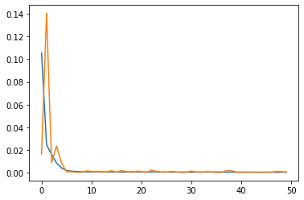

# **HackMTY 2021 | Reto Banorte**
## **49 - DFuture: Modelo de predicción de la inflación en México**
---
#### **Miembros:**
Abraham Cepeda Oseguera

Axel Mercado Gasque

Juan Carlos Garfias Tovar

---
### **Reto:**
Generar un modelo de nowcasting para pronosticar la variación anual de la inflación general y 
subyacente de la 1° Quin. Enero 2021 a la 1° Quin. Agosto 2021.

---
### **Solucion:**
Modelo de regresión multivariable (mejor resultado a largo plazo) y Random Forest (mejor resultado en datos conocidos)

Se realizaron y evaluaron 3 modelos:
- LSTM
- Random Forest
- Regresion

Se opto por el modelo de regresion debido a la correlacion directa de gran parte de las variables y la manera en la que predecia los valores para el 2021

---
### **Variables:**
Se creo un dataset con mas de 200 variables de factores economicos, comerciales, internacionales, entre otros. 

---
### **Resultadoss:**
Las graficas comparativas y de entrenamiento se encuentran en media y los archivos de datos en la carpeta de results

---
### **Ejecución y requerimientos:**
Se requiere de python 3, clonar el repositorio y hacer un install del requirements txt

***Se recomienda usar el jupyter notebook con Google Colab***

